# Quick Reference - Bomberman Bot Flow

## 🚀 Startup Sequence


## 🔄 Game Loop


## 📡 Event Handling


## 🎯 Continuous Movement

```mermaid
stateDiagram-v2
    [*] --> Idle: Initialize
    Idle --> Moving: startContinuousMove(direction)
    
    Moving --> CheckSame: New move command
    CheckSame --> Moving: Same direction (skip)
    CheckSame --> Stopping: Different direction
    
    Stopping --> Moving: Start new direction
    Moving --> Stopped: stopContinuousMove()
    
    Stopped --> Idle
    
    Moving --> Moving: Send every 50ms
    
    note right of Moving
        • Emit 'move' event
        • Update predictedPosition
        • Track currentDirection
    end note
    
    note right of Stopped
        • Clear interval
        • Reset currentDirection
    end note
```



## 📍 Position Tracking


## ⚙️ Key States

### isGameStarted
```
Dev Mode:     true  (from constructor)
Competition:  false → true (after 'start' event)
```

### isRunning
```
After initialize():     true
After bot death:        false
After shutdown():       false
```

### isConnected
```
Socket connected:       true
Socket disconnected:    false
```

### Bot can act when:
```
isGameStarted = true
AND
isRunning = true
AND
socket != null
```

## 🔍 Debug Commands

```typescript
// Status checks
bot.isConnected()              // Socket status
bot.isGameRunning()            // = isGameStarted
bot.isActive()                 // isRunning && isConnected()

// Position
bot.socketConnection.getCurrentPosition()     // Current pos
bot.socketConnection.predictedPosition        // Predicted next
bot.socketConnection.lastConfirmedPosition    // Server confirmed

// Movement
bot.socketConnection.currentDirection         // Current direction or null
bot.socketConnection.moveInterval             // Interval ID or null

// Info
bot.getBotInfo()              // Full bomber info
bot.getGameStats()            // Game statistics
bot.getGameState()            // Full game state

// AI
bot.getAIInfo()               // Strategy info with priorities
bot.updateStrategyPriority(name, priority)
bot.resetAI()                 // Reset to defaults
```

## 📊 Performance Metrics

| Metric | Value | Notes |
|--------|-------|-------|
| Bot Logic Loop | 500ms | Decision making frequency |
| Movement Send | 50ms | Continuous move frequency (20/sec) |
| Position Update | Realtime | Via player_move event |
| AI Strategy Count | 7 | Prioritized strategies |
| Event Listeners | 11 | All game events covered |

## 🎯 Priority Order

1. **Escape** (100) - Highest priority
2. **Attack** (80)
3. **Defense** (70)
4. **Collect** (60)
5. **Wall Break** (50)
6. **Explore** (40)
7. **Smart Nav** (30) - Lowest priority

## 📝 Event Summary

### Send to Server
- `join` - Join game room
- `move` - Move bot (continuous 50ms)
- `place_bomb` - Place bomb

### Receive from Server
- `user` - Initial game state
- `start` - Game start (competition)
- `finish` - Game end
- `player_move` - Position update
- `new_bomb` - Bomb placed
- `bomb_explode` - Bomb exploded
- `user_die_update` - Player death
- `chest_destroyed` - Chest broken
- `item_collected` - Item picked up
- `map_update` - Map changed
- `user_disconnect` - Player left
